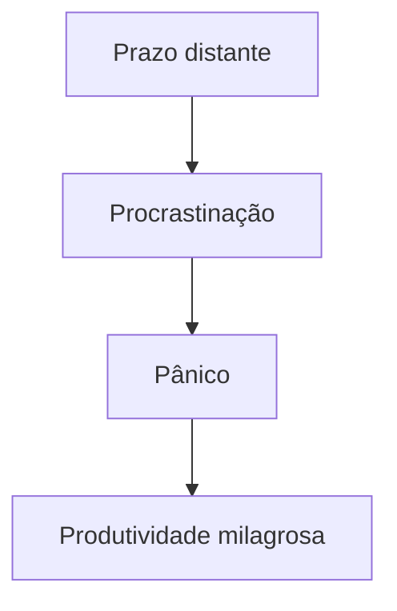

# Atlas das Coisas Estranhamente Específicas

Este documento existe exclusivamente para responder perguntas que ninguém fez.

## Capítulo 1 — O Som das Teclas do Teclado

Existe uma discussão silenciosa acontecendo no mundo da tecnologia:

**teclados barulhentos versus teclados silenciosos.**

### Classificação informal

#### Teclado silencioso

Características:

- Discreto
- Profissional
- Pouco dramático

Desvantagens:

- Não transmite a sensação de “estou trabalhando seriamente”.

#### Teclado mecânico absurdamente alto

Características:

- Barulhento
- Satisfatório
- Faz parecer que você está hackeando algo importante

Desvantagens:

- Todos no ambiente sabem exatamente quando você está procrastinando.

---

## Capítulo 2 — A Matemática da Preguiça

Existe uma fórmula teórica:

```text
motivação = urgência × culpa
```

Quanto mais próximo do prazo:

- Mais produtividade
- Mais desespero
- Mais café

### Exemplo visual



---

## Capítulo 3 — Tabela de Eventos Cotidianos

| Evento | Probabilidade | Consequência |
|--------|---------------|--------------|
| Derrubar algo no chão | Alta | Frustração |
| Esquecer por que entrou num cômodo | Muito alta | Crise existencial leve |
| Abrir a geladeira sem motivo | Extremamente alta | Nenhuma conclusão |

---

## Notas Técnicas Inúteis

### YAML de exemplo

```yaml
environment: development
mood: unstable
coffee:
  cups: 5
  quality: questionable
```

### Docker aleatório

```dockerfile
FROM node:22

WORKDIR /app

COPY . .

RUN npm install

EXPOSE 3000

CMD ["npm", "run", "dev"]
```

### Markdown dentro de Markdown

Você pode ter:

#### Texto em **negrito**

Texto em *itálico*.

Texto com ~~tachado~~.

Trechos `inline code`.

Blocos de citação:

> Às vezes o bug não é um bug.
>
> Às vezes é uma feature extremamente inconveniente.

---

## Lista excessivamente longa de coisas aleatórias

- Plantas que sobrevivem à negligência
- Pessoas que conseguem acordar cedo naturalmente
- O mistério das meias desaparecidas
- Por que bugs somem quando alguém está olhando
- Como sempre existe uma vírgula faltando
- A eterna luta entre tabs e spaces
- Frameworks JavaScript surgindo a cada 12 minutos

---

## Estrutura fictícia de projeto

```txt
project-root/
├── docs/
│   ├── getting-started.md
│   ├── api-reference.md
│   └── random-chaos.md
├── src/
│   ├── components/
│   ├── hooks/
│   └── services/
├── package.json
└── README.md
```

---

## Bloco de alerta

> [!WARNING]
> Não confie em commits feitos às 2 da manhã.

> [!TIP]
> Se funcionar, faça commit antes de tentar “melhorar”.

> [!IMPORTANT]
> Testes automatizados não substituem bom senso.

---

## Encerramento Dramático

Se você chegou até aqui, parabéns.

Você acabou de ler um documento gigantesco sobre absolutamente nada em particular.

Mas pelo menos agora seu Fumadocs vai ter bastante coisa pra renderizar 😌
